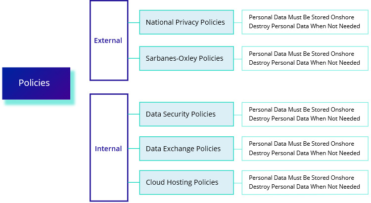

# Policies

Overarching organizational norms typically of a restrictive nature providing compulsory prescriptions in certain areas

Policies prescribe norms, they are compulsory and restrictive. This may include privacy policies, audit, data security policies, data exchange policies, cloud hosting policies. Policies are generally precise formulations of what "should not" be done.

### 

### Template

Document contains policies.

Policies may be categorized as follows:

* External
* Internal

Each policy has the following:

* Name - short name which identifies the policy
* Description - description of the policy

### Example

* External
  * National Privacy Policies
    * Policy 1: Personal Data Must Be Stored Onshore
    * Policy 2: Destroy Personal Data When Not Needed
  * Sarbanes-Oxley Policies
    * Policy 3: Log All Accesses to Accounting Systems
    * Policy 4: Retain Audit Trails and Emails for 5 Years
* Internal
  * Data Security Policies
    * Policy 5: No Sensitive Data on Mobile Devices
    * Policy 6: Store Credit Cards in Encrypted Formats
  * Data Exchange Policies
    * Policy 7: Do Not Share Key Data with Third Parties
    * Policy 8: Share Client Data with Trusted Partners
  * Cloud Hosting Policies
    * Policy 9: Use Only the PCI DSS Compliant Cloud
    * Policy 10: Do Not Store Health Data in the Cloud

### References

Source: Enterprise Architecture on a Page v1.4 \([http://eaonapage.com](http://eaonapage.com)\), Svyatoslav Kotusev \([http://kotusev.com](http://kotusev.com)\)

