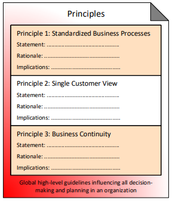

# Principles

Global high-level guidelines influencing all decision-making and planning in an organization

Principles are written high level guidelines which underpin decisions and enable Business Executives and IT architects to agree on the fundamentals. Principles define what is important for the organization, in a universal and abstract way.

Principles have the following:

* Name
* Statement
* Rationale
* Implications

Examples:

* Principle 1: Standardized Business Processes
* Principle 2: Single Customer View
* Principle 3: Business Continuity

