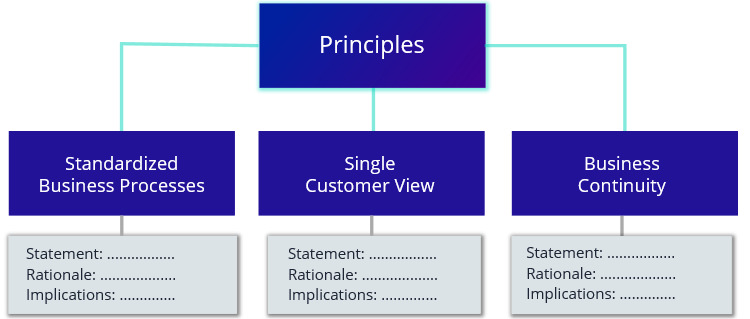

# Principles

Global high-level guidelines influencing all decision-making and planning in an organization

Principles are written high level guidelines which underpin decisions and enable Business Executives and IT architects to agree on the fundamentals. Principles define what is important for the organization, in a universal and abstract way.

### Template

Document contains a list of principles.

Each principle has the following structure:

* Name - short name which identifies the principle
* Statement - provides a more extended definition of the principle
* Rationale - justifies the reasons why this principle is adopted
* Implications - describes the consequences of adhering to the principle

### Examples

Principle 1: Standardized Business Processes

* Statement: Business processes should be standardized across all business units
* Rationale: Process standardization enables the company to work in a unified way to optimize global efficiency and reduce costs globally
* Implications: Process should be defined at a global level and supported by globally accessible applications used by all business units

Principle 2: Single Customer View

* Statement: Customer data should be shared between all business units
* Rationale: Customer data sharing enables unification and avoids duplication so that all business units have access to the single correct source of customer data, as well as enabling customer analytics
* Implications: Master version of customer data should be centralized and accessible to all business units

Principle 3: Business Continuity

* Statement: Critical business operations should never be interrupted, even in emergency cases
* Rationale: Uninterrupted 24/7 operations ensure a smooth and trusted customer experience
* Implications: Critical systems and databases should be geographically dispersed with replicas to ensure high system availability

### References

Source: Enterprise Architecture on a Page v1.4 \([http://eaonapage.com](http://eaonapage.com)\), Svyatoslav Kotusev \([http://kotusev.com](http://kotusev.com)\)

