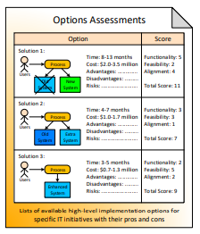

# Options Assessments

Lists of available high-level implementation options for specific IT initiatives with their pros and cons


TODO: Update image below


### References

Source: Enterprise Architecture on a Page v1.4 \([http://eaonapage.com](http://eaonapage.com)\), Svyatoslav Kotusev \([http://kotusev.com](http://kotusev.com)\)

