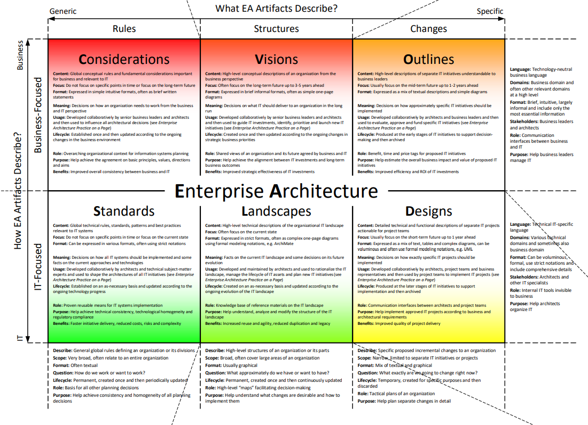

# Overview

There are various popular Enterprise Architecture frameworks \(such as TOGAF\) which an extensive list of artefacts. They key problem is that they are often heavy-weight with significant documentation which is never read and becomes more of a formalistic burden, rather than providing value. We found the approach proposed by Svyatoslav Kotusev which maps CSVLOD taxonomy to artefacts a much more "proven" approach which is successful in practice.

The artefact taxonomy consists of:

* Considerations
* Standards
* Visions
* Landscapes
* Outlines
* Designs

In the following pages, we review the theory of the diagrams as well as providing practical examples.

### 

### What EA Artefacts Describe?

#### Rules

 **Describe:** General global rules defining an organization or its divisions  
**Scope:** Very broad, often relate to an entire organization  
**Format:** Often textual  
**Question:** How do we work or want to work?  
**Lifecycle:** Permanent, created once and then periodically updated  
**Role:** Basis for all other planning decisions  
**Purpose:** Help achieve consistency and homogeneity of all planning decisions

#### Structures

 **Describe:** High-level structures of an organization or its parts  
**Scope:** Broad, often cover large areas of an organization  
**Format:** Usually graphical  
**Question:** What approximately do we have or want to have?  
**Lifecycle:** Permanent, created once and then continuously updated  
**Role:** High-level “maps” facilitating decision-making  
**Purpose:** Help understand what changes are desirable and how to implement them

#### Changes

 **Describe:** Specific proposed incremental changes to an organization  
**Scope:** Narrow, limited to separate IT initiatives or projects  
**Format:** Mix of textual and graphical  
**Question:** What exactly are we going to change right now?  
**Lifecycle:** Temporary, created for specific purposes and then discarded  
**Role:** Tactical plans of an organization  
**Purpose:** Help plan separate changes in detail

### How EA Artefacts Describe?

#### Business-Focused

 **Language:** Technology-neutral business language  
**Domains:** Business domain and often other relevant domains at a high level  
**Format:** Brief, intuitive, largely informal and include only the most essential information  
**Stakeholders:** Business leaders and architects  
**Role:** Communication interfaces between business and IT  
**Purpose:** Help business leaders manage IT

#### IT-Focused

 **Language:** Technical IT-specific language  
**Domains:** Various technical domains and sometimes also business domain  
**Format:** Can be voluminous, formal, use strict notations and include comprehensive details  
**Stakeholders:** Architects and other IT specialists  
**Role:** Internal IT tools invisible to business  
**Purpose:** Help architects organize IT

### References

Source: [http://eaonapage.com/](http://eaonapage.com/)

