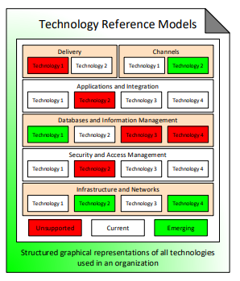
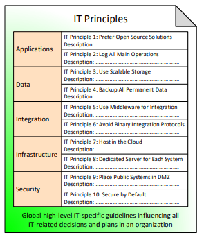

# Standards

Standards are used to describe the goal technical rules, standards, guidelines, best practices and patterns enabling a proven reusable mechanism for solution implementation. They are developed as-necessary by architects and technical experts, and periodically updated. They help to achieve technical consistency and uniformity as well as regulatory compliance. They decrease the delivery time for IT initiatives, reduce the related costs, risks and complexity.

### Technical Reference Models

They represent graphically the technologies used in the organizations, in order to manage and consolidate the technology portfolio.

Example divisions are:

* Applications and Integration
* Databases
* Security
* Infrastructure and Networks

For each of these, marking the status: Unsupported, current, Emerging.

### IT Principles

IT principles are high level IT guidelines which influence all IT decisions and plans.

Principle:

* Name
* Description

### Guidelines

Provide implementation-level prescriptions in certain technology-specific or domain-specific areas, so that architects and subject matter experts can share and reuse best practices.

Guidelines have:

* Name
* Description

Examples of guidelines are for deployment, Networking, Data Encryption, Interface Design, Development.

### References

Source: [http://eaonapage.com/](http://eaonapage.com/)

