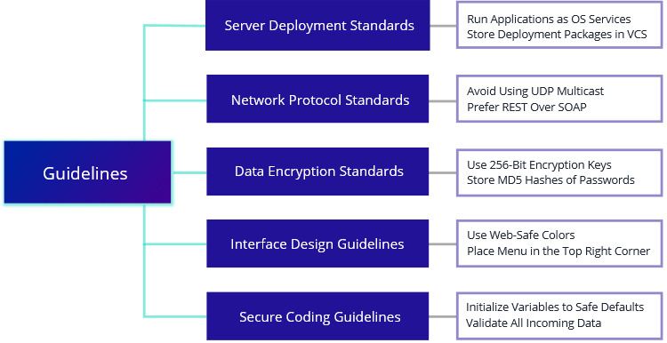

# Guidelines

IT-specific implementation-level prescriptions applicable in narrow technology-specific areas or domains

Provide implementation-level prescriptions in certain technology-specific or domain-specific areas, so that architects and subject matter experts can share and reuse best practices. Examples of guidelines are for Deployment, Networking, Data Encryption, Interface Design, Development.

### 

### Template

Guidelines have:

* Name
* Description

### Example

**Server Deployment Standards**

| Guideline | Description |
| :--- | :--- |
| Guideline 1: Run Applications as OS Services | Applications should be run as OS services |
| Guideline 2: Store Deployment Packages in VCS | Deployment packages should be stored in version control systems \(Git\) to ensure theri version history is stored |

**Network Protocol Standards**

| Guideline | Description |
| :--- | :--- |
| Guideline 3: Avoid Using UDP Multicast | UDP multicast should be avoided due to issues in reliability and error recovery |
| Guideline 4: Prefer REST Over SOAP | REST is preferred over SOAP due to higher simplicity and better performance |

**Data Encryption Standards**

| Guideline | Description |
| :--- | :--- |
| Guideline 5: Use 256-Bit Encryption Keys | To ensure high security, 256-Bit encryption keys should be used since then the encryyption is almost impossible to crack |
| Guideline 6: Store SHA512 Hashes of Passwords | Hash passwords when storing them inside databases, do not store as plain text |

**Interface Design Guidelines**

| Guideline | Description |
| :--- | :--- |
| Guideline 7: Use Web-Safe Colours | Use the web safe colour pallete \(256 colours\) because they are displayed on major browsers in a consistent way |
| Guideline 8: Place Menu in the Top Right Corner | The main navigation menu should be placed in the top right corner of web pages |

**Secure Coding Guidelines**

| Guideline | Description |
| :--- | :--- |
| Guideline 9: Initialize Variables to Safe Defaults | Initialize variables to safe default values \(zero for numeric types, false for boolean, null for other types\) |
| Guideline 10: Validate All Incoming Data | Ensure that all data which comes from external sources is validated before being processed |

### References

Source: Enterprise Architecture on a Page v1.4 \([http://eaonapage.com](http://eaonapage.com)\), Svyatoslav Kotusev \([http://kotusev.com](http://kotusev.com)\)

