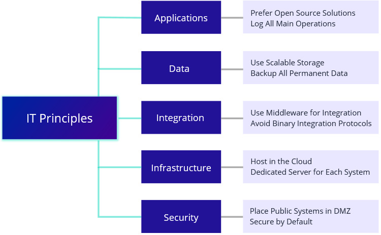

# IT Principles

Global high-level IT-specific guidelines influencing all IT-related decisions and plans in an organization

IT principles are high level IT guidelines which influence all IT decisions and plans.

### Template

Principle:

* Name
* Description

### Example

**Applications**

| Principle | Description |
| :--- | :--- |
| IT Principle 1: Prefer Open Source Solutions |  |
| IT Principle 2: Log All Main Operations |  |

**Data**

| Principle | Description |
| :--- | :--- |
| IT Principle 3: Use Scalable Storage |  |
| IT Principle 4: Backup All Permanent Data |  |

**Integration**

| Principle | Descriptio |
| :--- | :--- |
| IT Principle 5: Use Middleware for Integration |  |
| IT Principle 6: Avoid Binary Integration Protocols |  |

**Infrastructure**

| Principle | Description |
| :--- | :--- |
| IT Principle 7: Host in the Cloud |  |
| IT Principle 8: Dedicated Server for Each System |  |

**Security**

| Principle | Description |
| :--- | :--- |
| IT Principle 9: Place Public Systems in DMZ |  |
| IT Principle 10: Secure by Default |  |

### References

Source: Enterprise Architecture on a Page v1.4 \([http://eaonapage.com](http://eaonapage.com)\), Svyatoslav Kotusev \([http://kotusev.com](http://kotusev.com)\)

