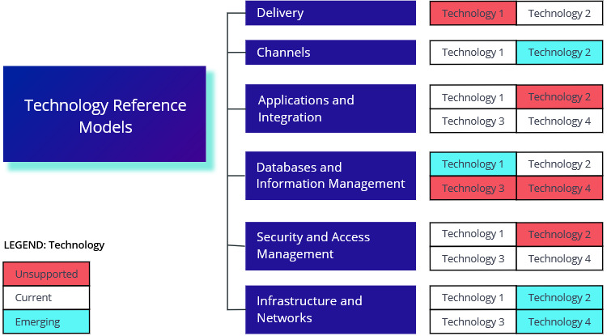

# Technical Reference Models

Structured graphical representations of all technologies used in an organization

They represent graphically the technologies used in the organizations, in order to manage and consolidate the technology portfolio.

### 

### Template

* Model
* Technologies
  * For each technology, marking the status: Unsupported, Current, Emerging

### Example

| Model | Current | Emerging | Unsupported |
| :--- | :--- | :--- | :--- |
| Delivery | React  | - | Angular  |
| Channels | REST  | - | SOAP  |
| Applications and Integration | Java Spring, ASP.NET | PHP | - |
| Databases and Information Management | MySQL | MongoDB | MSSQL  |
| Security and Access Management | Okta | - | OAuth0 |
| Infrastructure and Networks | AWS, Azure | - | On premise |

### References

Source: Enterprise Architecture on a Page v1.4 \([http://eaonapage.com](http://eaonapage.com)\), Svyatoslav Kotusev \([http://kotusev.com](http://kotusev.com)\)

