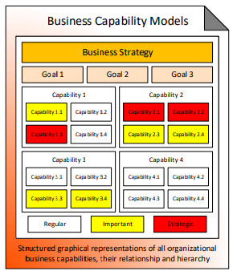
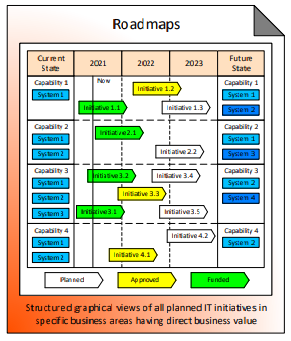

# Visions

Visions provide a high level conceptual overview of the organization from the business perspective. This enables Business and IT to have a shared view of the company and its future. They help to better identify and prioritize IT investments based on long term  business outcomes, thus enabling IT investments to have higher strategic effectiveness.

### Overview

 **Content:** High-level conceptual descriptions of an organization from the business perspective  
**Focus:** Often focus on the long-term future up to 3-5 years ahead  
**Format:** Expressed in brief informal formats, often as simple one-page diagrams

 **Meaning:** Decisions on what IT should deliver to an organization in the long run  
**Usage:** Developed collaboratively by senior business leaders and architects and then used to guide IT investments, identify, prioritize and launch new IT initiatives \(see Enterprise Architecture Practice on a Page\)  
**Lifecycle:** Created once and then updated according to the ongoing changes in strategic business priorities

 **Role:** Shared views of an organization and its future agreed by business and IT  
**Purpose:** Help achieve the alignment between IT investments and long-term business outcomes  
**Benefits:** Improved strategic effectiveness of IT investments

### Business Capability Models

Structured graphical representations of all organizational business capabilities, their relationship and hierarchy

Business Capacity Models help visualize organizational business capabilities, so that future IT investments can be focused on the most critical business areas. One page artefacts with color-coding, heatmapped representation.

Simple representation:

* Identify the Capabilities \(and the Sub-capabilities\)
* indicate the Investment Status \(Underinvested, Adequate or Overinvested\) for each of the Sub-capabilities

Complex representation:

* Describe the Business Strategy and Vision
* Identify the Goals and the Objectives
* Identify the Capabilities \(and the Sub-capabilities\)
* Identify the Markets, Customers, Suppliers and Partners
* Indicate the Priority \(Regular, Important, Strategic\) for the Sub-capabilities, Markets, Customers, Suppliers and Partners
* Indicate the Quality and Cost levels for the Sub-capabilities

Maturity Analysis and Gap Analysis:

* Indicate the Maturity \(Low, Medium High\) for each of the Sub-capabilities, including both the Current Maturity and the Target Maturity
* Based on the Maturity analysis, indicate the Gap level \(No Gap, Small Gap, Large Gap\)

Strategy Mapping:

* For each of the Sub-capabilities, mark the capability components \(P = Processes, S = Staff, I = Information, T = Technology\) with Strategic Priority \(Low, Medium, High\)
* Mark which Capabilities are core and which ones can be outsourced
* Map problems and outcomes to Sub-capabilities

_Note: Capabilities are Level 1, Sub-Capabilities are Level 2_

Examples:

* Business Strategy
* Goals
  * Goal 1
  * Goal 2
  * Goal 3
* Capabilities
  * Capability 1
    * Capability 1.1
    * Capability 1.2
    * Capability 1.3
    * Capability 1.4
  * Capability 2
    * Capability 2.1
    * Capability 2.2
    * Capability 2.3
    * Capability 2.4
  * Capability 3
    * Capability 3.1
    * Capability 3.2
    * Capability 3.3
    * Capability 3.4
  * Capability 4
    * Capability 4.1
    * Capability 4.2
    * Capability 4.3
    * Capability 4.4

### Target States

High-level graphical descriptions of the desired long-term future state of an organization

### Roadmaps

Structured graphical views of all planned IT initiatives in specific business areas having direct business value

Roadmaps help visualize the planned IT initiatives in certain business areas so that IT investments can be prioritized based on business importance. The represent tentative IT delivery schedules, with approximate start and end dates.

Simple roadmaps:

* Capabilities, and marking the Priority level \(Normal, High, Critical\)
* Time \(Years\), and also a marker for Now
* For each of the Capabilities, indicate the Initiatives across Time, including the status \(Proposed, Agreed, Active\)

Complex roadmaps:

* Goals
* Time \(Years\) including the planned yearly budget, and market for Now
* Initiatives:
  * Goals are linked to Initiatives
  * Initiatives are linked to Time to represent stat and end
  * There may be dependencies between dependencies \(e.g. an initiative to start after another initiative\)
  * Indicate the Budget level \(Small, Medium, Large\)
  * Indicate the Status \(Planned, Approved, Funded\)
* Current State:
  * Problems
  * Capabilities \(and Systems\)
* Future State:
  * Outcomes
  * Capabilities \(and Systems\)

Exotic roadmaps:

* Time: This Year, Next Year, futurre
* Business Divisions: Division 1, Division 2, Division 2
* Initiatives with the focus \(Applications, Information, Tools\) and short overview of the goals they attempt to achieve

### References

Source: [http://eaonapage.com/](http://eaonapage.com/)

