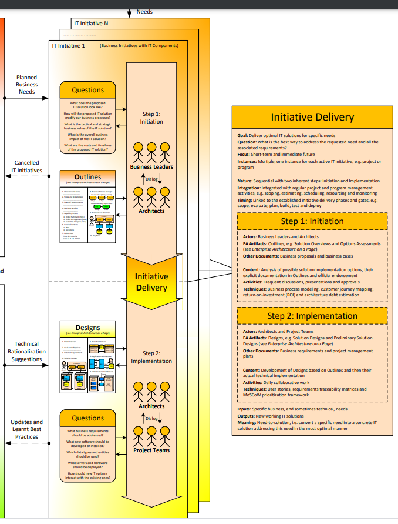

# Initiative Delivery

### Overview

### Process

**Goal:** Deliver optimal IT solutions for specific needs  
**Question:** What is the best way to address the requested need and all the associated requirements?  
**Focus:** Short-term and immediate future  
**Instances:** Multiple, one instance for each active IT initiative, e.g. project or program  
  
**Nature:** Sequential with two inherent steps: Initiation and Implementation  
**Integration:** Integrated with regular project and program management activities, e.g. scoping, estimating, scheduling, resourcing and monitoring  
**Timing:** Linked to the established initiative delivery phases and gates, e.g. scope, evaluate, plan, build, test and deploy

**Inputs:** Specific business, and sometimes technical, needs  
**Outputs:** New working IT solutions  
**Meaning:** Need-to-solution, i.e. convert a specific need into a concrete IT solution addressing this need in the most optimal manner

Step 1: Initiation

**Actors:** Business Leaders and Architects  
**EA Artifacts:** Outlines, e.g. Solution Overviews and Options Assessments \(see Enterprise Architecture on a Page\)  
**Other Documents:** Business proposals and business cases  
  
**Content:** Analysis of possible solution implementation options, their explicit documentation in Outlines and official endorsement  
**Activities:** Frequent discussions, presentations and approvals  
**Techniques:** Business process modeling, customer journey mapping, return-on-investment \(ROI\) and architecture debt estimation

Step 2: Implementation

**Actors:** Architects and Project Teams  
**EA Artifacts:** Designs, e.g. Solution Designs and Preliminary Solution Designs \(see Enterprise Architecture on a Page\)  
**Other Documents:** Business requirements and project management plans  
  
**Content:** Development of Designs based on Outlines and then their actual technical implementation  
**Activities:** Daily collaborative work  
**Techniques:** User stories, requirements traceability matrices and MoSCoW prioritization framework

### Outlines - Questions \(Business Leaders & Architects\)

What does the proposed IT solution look like?

How will the proposed IT solution modify our business processes?

What is the tactical and strategic business value of the IT solution?

What is the overall business impact of the IT solution?

What are the costs and timelines of the proposed IT solution?

### Designs - Questions \(Architects & Project Teams\)

What business requirements should be addressed?

What new software should be developed or installed?

Which data types and entities should be used?

What servers and hardware should be deployed?

How should new IT systems interact with the existing ones?

### References 

Source: [http://eaonapage.com/](http://eaonapage.com/)

