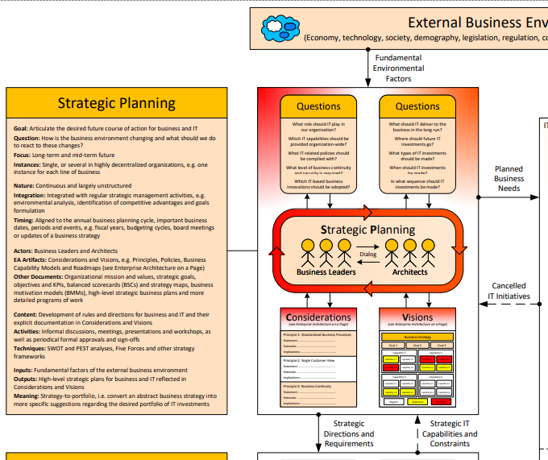

# Strategic Planning

### Overview

### Process

#### Goals & Focus

* **Goal:** Articulate the desired future course of action for business and IT
* **Question:** How is the business environment changing and what should we do to react to these changes?
* **Focus:** Long-term and mid-term future
* **Instances:** Single, or several in highly decentralized organizations, e.g. one instance for each line of business

#### Nature & Timing

* **Nature:** Continuous and largely unstructured
* **Integration:** Integrated with regular strategic management activities, e.g. environmental analysis, identification of competitive advantages and goals formulation
* **Timing:** Aligned to the annual business planning cycle, important business dates, periods and events, e.g. fiscal years, budgeting cycles, board meetings or updates of a business strategy

#### Actors & Artefacts

* **Actors:** Business Leaders and Architects
* **EA Artifacts:** Considerations and Visions, e.g. Principles, Policies, Business Capability Models and Roadmaps \(see Enterprise Architecture on a Page\)
* **Other Documents:** Organizational mission and values, strategic goals, objectives and KPIs, balanced scorecards \(BSCs\) and strategy maps, business motivation models \(BMMs\), high-level strategic business plans and more detailed programs of work

#### Content & Activities

* **Content:** Development of rules and directions for business and IT and their explicit documentation in Considerations and Visions
* **Activities:** Informal discussions, meetings, presentations and workshops, as well as periodical formal approvals and sign-offs
* **Techniques:** SWOT and PEST analyses, Five Forces and other strategy frameworks

#### Inputs & Outputs

* **Inputs:** Fundamental factors of the external business environment
* **Outputs:** High-level strategic plans for business and IT reflected in Considerations and Visions
* **Meaning:** Strategy-to-portfolio, i.e. convert an abstract business strategy into more specific suggestions regarding the desired portfolio of IT investments

### References

Source: Enterprise Architecture Practice on a Page v1.1 \([http://eaonapage.com](http://eaonapage.com)\), Svyatoslav Kotusev \([http://kotusev.com](http://kotusev.com)\)

