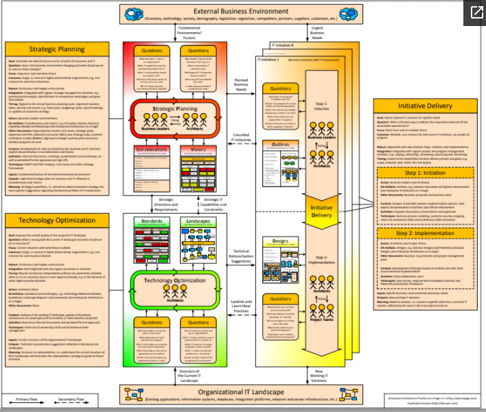

# Overview

The core process and participants within EA practice, based on works of Svyatoslav Kotusev.

### External Business Environment

\(Economy, technology, society, demography, legislation, regulation, competitors, partners, suppliers, customers, etc.\)

### Organizational IT Landscape

\(Existing applications, information systems, databases, integration platforms, network and server infrastructure, etc.\)

### References

Source: [http://eaonapage.com/](http://eaonapage.com/)

