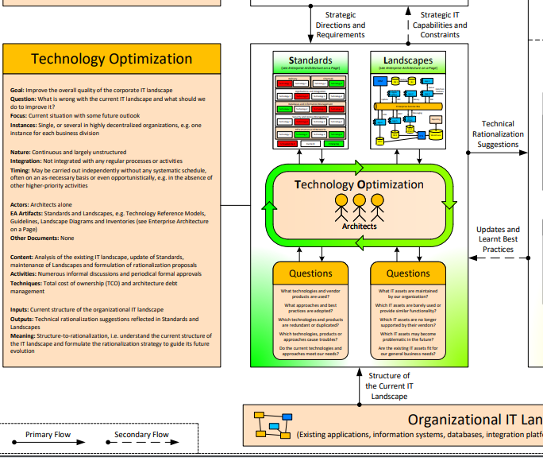

# Technology Optimization

### Overview

### Standards - Questions \(Architects\)

What technologies and vendor products are used?

What approaches and best practices are adopted?

Which technologies and products are redundant or duplicated?

Which technologies, products or approaches cause troubles?

Do the current technologies and approaches meet our needs?

### Landscapes - Questions \(Architects\)

What IT assets are maintained by our organization?

Which IT assets are barely used or provide similar functionality?

Which IT assets are no longer supported by their vendors?

Which IT assets may become problematic in the future?

Are the existing IT assets fit for our general business needs?

### References 

Source: [http://eaonapage.com/](http://eaonapage.com/)

